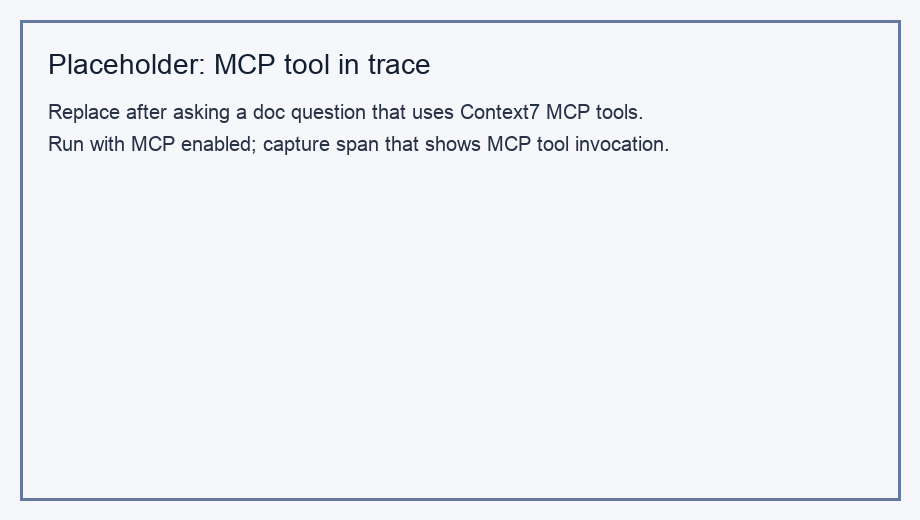

# MCP observability (Context7)

*Replace this placeholder with a trace showing a Context7 / MCP tool call.*

## Setup

The agent loads tools from the Context7 MCP server at `https://mcp.context7.com/mcp` (override with `MCP_CONTEXT7_URL` if needed). Set `DISABLE_MCP=1` to turn MCP off and use only DuckDuckGo.

## What I see in traces

With MCP enabled, Braintrust traces include **extra tool spans** beside `duckduckgo_search`. MCP tool names follow the remote server’s schema (documentation resolution / library lookup). Compared to DuckDuckGo, MCP spans often carry **different arguments** (e.g. library id or query string for docs) and may complete faster or slower depending on Context7 latency rather than web search ranking.

## DuckDuckGo vs MCP

**DuckDuckGo** spans reflect open-web search: large unstructured snippets in the result. **MCP / Context7** spans reflect **targeted documentation retrieval**, which is easier to spot in the span attributes or tool output preview. For a fair comparison, ask one news-style question (search) and one “how do I use X API?” question (docs) in the same Braintrust project and open both traces.
