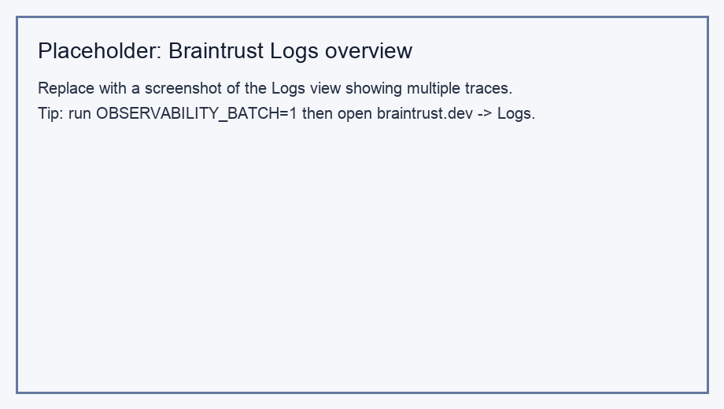
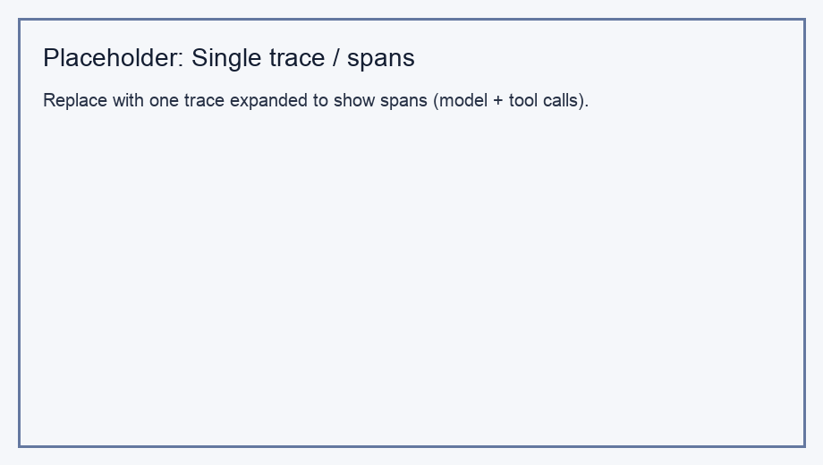
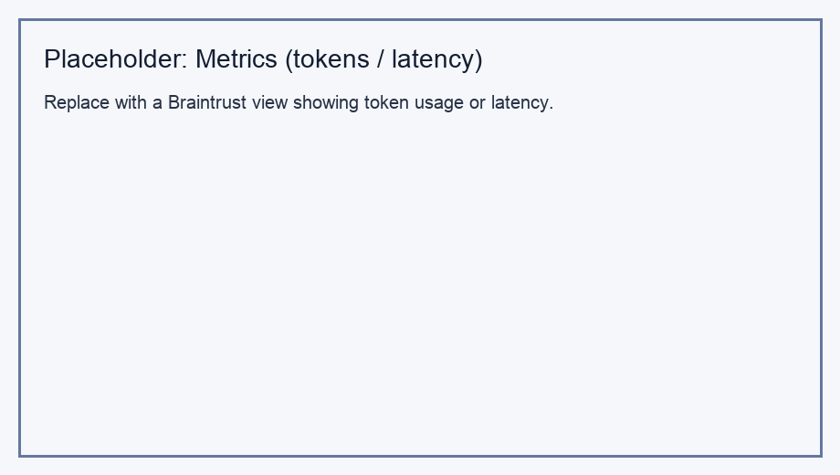

# Agent observability — Braintrust analysis

**Before submitting:** Run the agent yourself, open your Braintrust project, and **edit this file** so the paragraphs describe what *you* actually see (and swap in real screenshots for the PNGs). The template below matches the lab structure.

This write-up reflects runs of `simple-agent-observability/agent.py` with OpenTelemetry exported to Braintrust (see `architecture.md` for GenAI semantic conventions).

## Traces and spans

In the **Logs** view, each user turn shows up as a trace whose hierarchy typically includes spans for the Strands agent loop, the Anthropic chat completion, and **tool** spans when the model calls `duckduckgo_search`. Expanding a single trace (Figure: `braintrust-trace-details.png`) makes the ordering clear: the model decides to search, the tool span records the DuckDuckGo request, then another model span summarizes results for the user. When Context7 MCP tools are enabled (default unless `DISABLE_MCP=1`), additional tool spans appear for documentation lookups; those differ from DuckDuckGo spans in name and payload shape, which is easy to see side-by-side in the same trace.

## Metrics

Braintrust surfaces **token usage** and **latency** (or duration-style fields) per trace or aggregated in the metrics/analytics views. Across the three batch queries suggested in the lab (AI news, Nobel Prize, ML trends), traces that trigger web search tend to show **higher total tokens and longer wall time** than a hypothetical single-turn chat without tools, because the model receives large JSON snippets from the search tool before answering. The metrics view (Figure: `braintrust-metrics.png`) helps compare those runs and spot outliers—for example, a slow trace might correlate with a broad query returning many search hits.

## Observations

The overview screenshot (`braintrust-overview.png`) is useful for seeing **how many runs** you generated in one session and for jumping into any trace. One pattern worth noting: **similar questions still produce distinct traces**, so you can compare tool-call frequency and token counts across prompts. For grading, replace the placeholder PNGs in this folder with your own full-resolution captures from the Braintrust UI after running `bash run_observability_lab.sh` (or interactive `uv run python agent.py`).

*Logs list (replace placeholder with your Braintrust screenshot).*

*Single trace with spans (replace with your screenshot).*

*Token or latency metrics (replace with your screenshot).*
